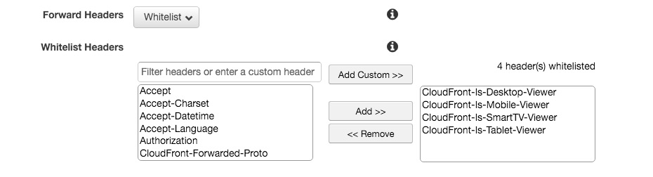

# Amazon CloudFront plugin for FarCry Core 7.x

This plugin will add support for device detection using [CloudFront device type headers](http://docs.aws.amazon.com/AmazonCloudFront/latest/DeveloperGuide/header-caching.html#header-caching-web-device).
Support for other CloudFront features may be added in the future.

## Installation

- extract the plugin to `/farcry/plugins/cloudfront`
- register the plugin in your `farcryContructor.cfm`

## Configure CloudFront

1. Configure CloudFront to cache objects based on the CloudFront device type headers

2. Add the cookie name `FARCRYDEVICETYPE` to the whitelist of forwarded cookies

